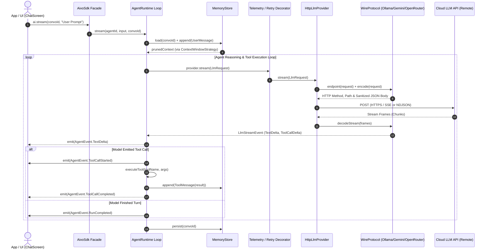

# Aivo SDK — Architecture & Internals Guide

A comprehensive, production-grade overview of the **Aivo SDK** architecture, design patterns, internal execution flow, and extensibility model for Kotlin Multiplatform (Android, JVM, iOS).

---

## 1. Executive Summary & Design Principles

The **Aivo SDK** is designed to provide a unified, provider-agnostic, and type-safe abstraction for building autonomous AI agents and streaming LLM applications.

### Core Architectural Principles

1. **Clean Architecture (Hexagonal / Ports & Adapters):**
   * Dependencies strictly point inward.
   * The domain layer (`sdk-core`) has zero dependencies on network frameworks (Ktor), serialization engines, UI frameworks, or vendor APIs.
   * Application services (`sdk-runtime`) interact with providers and tools solely through interfaces (**Ports**).
2. **SOLID & Open-Closed Principle:**
   * Adding a new LLM provider (e.g. Anthropic, Mistral, Groq) requires creating an infrastructure adapter implementing `WireProtocol` or `LlmProvider` without touching core execution logic.
3. **Multiplatform by Design:**
   * 100% Kotlin Multiplatform (Android, JVM, iOS Darwin) without platform-specific forks.
4. **Unified Developer Experience (DX):**
   * **Level 1:** Raw LLM client calls (`ai.llm(...)`).
   * **Level 2:** Single agent with autonomous tool execution.
   * **Level 3:** Hierarchical multi-agent supervisor with event-driven streaming and delegation.

---

## 2. Layer Map & Module Responsibilities

The codebase is organized into four distinct architectural layers across modular Gradle subprojects:

```
┌─────────────────────────────────────────────────────────────────────────────┐
│  LAYER 4 — Composition Root & Public Facade                                 │
│  :sdk                                                                       │
│  • AivoSdk (Top-level Interface)        • AivoSdkBuilder (Config DSL)       │
│  • AivoProvider (Provider Catalog)      • AivoSdk.create(...) (Fast Start)  │
├─────────────────────────────────────────────────────────────────────────────┤
│  LAYER 3 — Application Services & Runtime                                   │
│  :sdk-runtime            :sdk-middleware             :sdk-agent-config      │
│  • AgentRuntime (Loop)   • RetryingLlmProvider       • MarkdownAgentLoader  │
│  • ToolRegistry          • LoggingLlmProvider        • JsonAgentLoader      │
│  • MemoryStore           • TelemetryLlmProvider      • ResourceReader       │
├─────────────────────────────────────────────────────────────────────────────┤
│  LAYER 2 — Infrastructure Adapters & Transport                              │
│  :sdk-transport          :sdk-provider-ollama        :sdk-provider-gemini   │
│  • HttpLlmProvider       • OllamaProvider            • GeminiProvider       │
│  • WireProtocol          • OllamaWireProtocol        • GeminiWireProtocol   │
│  • SseDecoder / Ndjson   • OllamaModel (Enum)        • GeminiModel (Enum)   │
│                          :sdk-provider-openai-compatible                    │
│                          • OpenAiCompatibleProvider / OpenRouterProvider    │
│                          • OpenRouterModel (Enum)                           │
├─────────────────────────────────────────────────────────────────────────────┤
│  LAYER 1 — Domain & Ports (Zero External Dependencies)                      │
│  :sdk-core                                                                  │
│  • Domain Models (Message, LlmRequest, ToolCall, AgentEvent, ModelRef)       │
│  • Ports (LlmProvider, Tool, CredentialsProvider, ProviderModel)            │
│  • Standard Error Hierarchy (SdkException, RateLimitException, etc.)        │
└─────────────────────────────────────────────────────────────────────────────┘
```

---

## 3. Module Breakdown

### 3.1. `sdk-core` (Layer 1 — Domain & Ports)
* **Responsibility:** Contains all domain models, contracts (ports), and the exception hierarchy.
* **Key Contracts:**
  * `LlmProvider`: The core port through which requests are sent (`generate()`, `stream()`).
  * `Tool`: Interface defining tool specs and execution logic.
  * `ProviderModel`: Common contract for strongly-typed model enums (`modelId`, `isFree`, `displayName`, `toModelRef()`).
  * `CredentialsProvider`: Async credential supplier (static keys, OAuth tokens, dynamic vault retrieval).
* **Dependencies:** Only Kotlin standard library, Coroutines (`kotlinx.coroutines`), and Serialization (`kotlinx.serialization`).

### 3.2. `sdk-transport` & `sdk-provider-*` (Layer 2 — Infrastructure)
* **`sdk-transport`:**
  * Houses the generic `HttpLlmProvider` which connects to any HTTP/REST provider.
  * Translates stream frames via `SseDecoder` (Server-Sent Events) and `NdjsonDecoder` (Newline-Delimited JSON).
  * Automatically resolves URLs and removes duplicate path segments.
* **`sdk-provider-ollama`:**
  * Implements `OllamaWireProtocol` (routes to `/api/chat` with NDJSON framing).
  * Contains `OllamaModel` enum categorizing Free and Paid models.
* **`sdk-provider-openai-compatible`:**
  * Implements `OpenAiCompatibleWireProtocol` (SSE framing with `data: [DONE]`).
  * Pre-configured presets for **OpenRouter**, Groq, Together AI, and OpenAI.
  * Contains `OpenRouterModel` enum with Free and Paid tier catalogs.
* **`sdk-provider-gemini`:**
  * Implements Google Gemini REST protocol (`/v1beta/models/{model}:streamGenerateContent?alt=sse`).
  * Supports stateful sessions (`previous_interaction_id`) and thought signatures.
  * Contains `GeminiModel` enum with Free Tier and Paid-Only models.

### 3.3. `sdk-runtime` & `sdk-middleware` (Layer 3 — Application Services)
* **`sdk-runtime`:**
  * **`AgentRuntime`:** Implements the reasoning and tool-calling execution loop. Handles model turns, tool execution, argument validation, and step limits.
  * **`MemoryStore` & `ContextWindowStrategy`:** Manages conversation state (`InMemoryMemoryStore`) and history pruning (`KeepAllStrategy`, `SlidingWindowStrategy`, `SummarizingStrategy`).
  * **Delegation Manager:** Enables parent agents to delegate subtasks to specialized child agents.
* **`sdk-middleware`:**
  * Uses the **Decorator Pattern** to wrap any `LlmProvider`:
    * `RetryingLlmProvider`: Automatic retry with exponential backoff and jitter on 429/5xx status codes.
    * `LoggingLlmProvider`: Structured logging with automatic sensitive token redaction.
    * `TelemetryLlmProvider`: Captures latency, token counts, and invocation metrics.

### 3.4. `sdk` (Layer 4 — Facade & Composition Root)
* **Responsibility:** Binds all layers into a unified API surface.
* **Key Components:**
  * `AivoSdkBuilder`: Fluent DSL to register providers, tools, agents, memory, and telemetry. Validates references and checks for circular delegations at build time.
  * `AivoSdk.create(...)`: High-level factory that creates a ready-to-use SDK instance with default cloud endpoints in a single line of code.
  * `AivoProvider`: Top-level catalog enum for available providers and model catalogs.

---

## 4. End-to-End Execution Flow

When a client application invokes `ai.stream(conversationId, "Hello")`, the request traverses the system through a deterministic pipeline:



---

## 5. Model Management & Best Practices

Rather than using fragile hardcoded strings, the SDK adopts a **type-safe, extensible model catalog**:

```
                       ┌──────────────────────┐
                       │    ProviderModel     │ (Interface in sdk-core)
                       │ • modelId: String    │
                       │ • isFree: Boolean    │
                       │ • displayName: String│
                       │ • toModelRef()       │
                       └──────────▲───────────┘
                                  │
         ┌────────────────────────┼────────────────────────┐
         │                        │                        │
┌────────────────┐       ┌─────────────────┐      ┌────────────────┐
│  OllamaModel   │       │ OpenRouterModel │      │  GeminiModel   │
│ (Free & Paid)  │       │  (Free & Paid)  │      │ (Free & Paid)  │
└────────────────┘       └─────────────────┘      └────────────────┘
```

### Advantages of This Design:
1. **Compile-time Safety:** Autocomplete in IDEs prevents typos (e.g. `GeminiModel.GEMINI_3_8_FLASH`).
2. **Metadata Aware:** Built-in `.isFree` flags allow apps to show free vs. paid badges in UIs.
3. **Open for Extension:** Custom or newly released models can still be passed as standard strings:
   ```kotlin
   // Using strongly-typed enum:
   val ai = AivoSdk.create(model = OllamaModel.GPT_OSS_120B, apiKey = "...")

   // Using custom / unlisted model:
   val ai = AivoSdk.create(provider = AivoProvider.OPEN_ROUTER, model = "custom/my-model", apiKey = "...")
   ```

---

## 6. Developer Usage Levels

### Level 1 — Raw LLM Client (No Agent Loop)
Direct, low-overhead generation without memory or agent supervisors:
```kotlin
val ai = AivoSdk.create(model = GeminiModel.GEMINI_3_8_FLASH, apiKey = "...")
val response = ai.llm("gemini:gemini-3.8-flash").generate("Explain quantum computing in 1 sentence.")
println(response.text)
```

### Level 2 — Single Agent with Tools
Automatic reasoning and function calling:
```kotlin
val ai = AivoSdk.create(
    model = OllamaModel.GPT_OSS_120B,
    tools = listOf(
        tool("get_weather", "Fetches temperature for city") {
            execute { args, _ -> ToolResult.Success(buildJsonObject { put("temp", "24C") }) }
        }
    )
)

ai.stream(ConversationId("session-1"), "What's the weather in Tokyo?").collect { event ->
    when (event) {
        is AgentEvent.TextDelta -> print(event.text)
        is AgentEvent.ToolCallStarted -> println("\n[Running tool: ${event.toolName}...]")
        is AgentEvent.RunCompleted -> println("\n[Done]")
        else -> {}
    }
}
```

### Level 3 — Multi-Agent Supervisor
Hierarchical team orchestration with delegation:
```kotlin
val ai = AivoSdk {
    providers {
        gemini { apiKey("...") }
        openRouter { apiKey("...") }
    }
    defaultModel("gemini:gemini-3.8-flash")

    agents {
        define("coder") {
            systemPrompt = "You are an expert Kotlin engineer."
        }
        define("supervisor") {
            systemPrompt = "You coordinate user requests and delegate technical tasks to coder."
            delegates("coder")
        }
    }

    entryAgent("supervisor")
}
```

---

## 7. Security & Guardrails

* **Zero Metadata Leakage:** Internal execution markers (`_runId`, `_conversationId`, `_stepIndex`) are filtered out before payloads leave the device over HTTP.
* **Secret Masking:** Logging middleware automatically masks headers containing `api-key`, `authorization`, and bearer tokens.
* **Deterministic Limits:** `AgentLimits` enforces maximum execution steps, max tool calls per turn, and per-request timeouts to prevent infinite loops and runaway billing.
