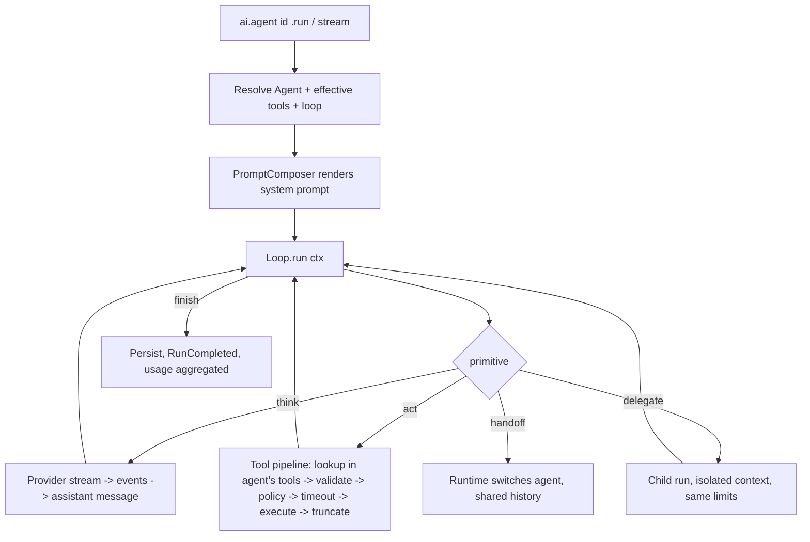

# Aivo SDK v2 — Generic Agent Framework: Design & Implementation Plan

> Audience: the engineer/agent who will extend SDK v1. Part A is the design (answers your 14 points).
> Part B is the implementation plan and the working agreement. Class names that already exist in v1
> (`AgentRuntime`, `AgentDefinition`, `Tool`, `ToolRegistry`, `ToolResult`, `AgentEvent`, `AivoSdk`, `AivoSdkBuilder`,
> `ConversationId`, `LlmProvider`) are kept. New names are proposals; if v1 already has an equivalent, keep the v1 name.

---

# PART A — DESIGN

## 0. The idea in one page

v2 adds **three nouns** and nothing else. Everything a developer does is a combination of them.

| Noun | What it is | Default |
|---|---|---|
| **Agent** | An immutable description of *who* does the work: role, prompt, instructions, tools, team, model, loop. | Works with just an `id` + `role`. |
| **Tool** | A named action the model may call, with a schema. Reusable objects, not strings. | Plain `execute { }` lambda. |
| **Loop** | The algorithm that runs an agent: how it thinks, calls tools, delegates, and stops. | `ToolCallingLoop` (the v1 behavior). |

Key consequences:
- A **supervisor** is just an agent whose team is non-empty.
- A **workflow** (sequence, router, review cycle) is just an agent whose loop is a workflow loop.
- A **custom orchestrator** is just a custom loop.
- So there is no separate "workflow engine", "supervisor class", or "graph builder" to learn.

The SDK stays **simple by default** (three lines to run an agent) and **open when needed** (replace the loop, keep everything else: memory, limits, streaming, telemetry, tool safety).

---

## 1. Goals of the new agent system

**Goals**
1. Define a custom agent with a few lines: role, goal, prompt, instructions, responsibilities, rules, tools, team.
2. No built-in agent types, no domain assumptions, no required agent structure.
3. Attach, share, remove and inspect tools per agent with explicit, readable code.
4. Single agent, supervisor + specialists, handoff chains, fixed pipelines, or fully custom orchestration, all with the same primitives.
5. Default loop for simplicity; **replaceable loop** for control, without losing safety guarantees.
6. Backward compatible with v1 (`define { }`, `AgentDefinition`, `ai.chat`, `ai.stream`).
7. Every relationship (agent→tool, agent→agent) is declared, validated at build time, and inspectable.

**Non-goals (YAGNI, do not build in v2)**
- Visual workflow builder, generic node/edge graph DSL, plugin marketplace for loops.
- Persistent workflow checkpoints/resume, distributed execution.
- Autonomous agent-to-agent free-form chat outside declared relationships.
- New providers or provider changes.

---

## 2. What an agent is: responsibilities and capabilities

An agent **is**: an immutable configuration (`Agent`) + a loop that runs it.

An agent **can**:
1. Hold an identity (`id`, `name`, `role`, `description`).
2. Carry behavior (prompt sections, instructions, rules, style, output format).
3. Use a specific model and generation options (falls back to the SDK default).
4. Use tools (only the ones it was given).
5. Work with other agents through declared relationships: **delegate** (call as a tool and get a result back) or **handoff** (transfer control).
6. Read and write shared run state (results passed between agents).
7. Run under its own loop (default or custom), hooks and limits.

An agent **does not**: own memory storage, HTTP, provider wiring, or tool execution safety. Those stay in the runtime (single responsibility). This is what lets a custom loop be safe.

---

## 3. How custom agents are defined

### 3.1 Anatomy

| Field | Purpose | Required |
|---|---|---|
| `id` | Unique key (`^[a-z][a-z0-9_]{0,63}$`) | yes |
| `role` | One-line identity ("Research analyst") | recommended |
| `description` | What this agent is good for. Used as the tool description when another agent delegates to it. | **required if another agent manages it** |
| `goal` | The outcome it optimizes for | no |
| `responsibilities` | What it owns | no |
| `instructions` | How to do the work (ordered) | no |
| `rules` | Hard constraints and behavior ("never invent sources") | no |
| `style` | Tone/voice | no |
| `outputFormat` | Expected shape of its final answer | no |
| `systemPrompt` | Free-form base text (full control) | no |
| `tools` | Tools and toolboxes it may call | no |
| `delegates` / `handoffs` | Its team (relationships) | no |
| `model`, `options`, `limits` | Per-agent overrides | no |
| `loop`, `hooks` | Execution customization | no |
| `saveResultAs` | Store its final answer in run state under this key | no |

### 3.2 Minimal definition (the whole thing)

```kotlin
val helper = agent("helper") {
    role = "Friendly assistant"
}
```

### 3.3 Defining it three equivalent ways

```kotlin
// 1) Kotlin DSL (primary)
val researcher = agent("researcher") { role = "Research analyst"; tools(webSearch) }

// 2) Markdown file (no rebuild needed to change behavior)
agents { fromMarkdown(assets("agents/")) }

// 3) Data (v1 style, still supported)
agents { define("researcher") { systemPrompt = "..." } }
```
All three produce the same `Agent`/`AgentDefinition`. There is one internal model.

---

## 4. Customizing role, prompt, instructions, behavior

### 4.1 Prompt composition (`PromptComposer` port)

The structured fields are rendered into the system prompt by a `PromptComposer` (default: `SectionedPromptComposer`). Fixed, documented order:

```text
[systemPrompt (if provided)]
# Role            <- role
# Goal            <- goal
# Responsibilities <- bullets
# Instructions    <- numbered
# Rules           <- bullets (hard constraints)
# Style           <- text
# Team            <- auto-generated from delegates/handoffs (name + description)   [only if team non-empty]
# Output format   <- text
```
- Empty sections are omitted (no noise, no wasted tokens).
- `systemPrompt` is the base text; structured sections are appended. Set `promptMode = PromptMode.Raw` to send `systemPrompt` exactly as written.
- `{{variable}}` and `{{state.key}}` placeholders are rendered per run (`variables` from `AgentInput`, `state` from run state). Strict by default: a missing variable is a `ConfigurationException`. No expressions, no code in templates.
- Replace the whole composer with `promptComposer = MyComposer` (Open/Closed).

### 4.2 Modify or extend an agent (immutable, no shared mutation)

```kotlin
val seniorResearcher = researcher.extend("senior_researcher") {
    role = "Senior research analyst"
    instructions("Always cross-check with at least two sources")
    tools(readPage)
    removeTools(quickSearch)
}
```
- `extend(newId) { }` copies everything, then applies the block. The original is untouched.
- List properties append; `removeXxx` / `clearXxx` exist for removal. There is no hidden inheritance chain.

### 4.3 Markdown format (extended from v1)

```markdown
---
id: researcher
role: Research analyst
description: Finds and verifies facts. Returns sourced notes.
tools: [web_search, read_page]     # names or toolbox names
delegates: []
handoffs: []
loop: tool_calling                 # or a registered loop name
save_result_as: notes
max_steps: 8
---
Base system prompt text here.

## Responsibilities
- ...
## Instructions
- ...
## Rules
- ...
```
Section headings (`Responsibilities`, `Instructions`, `Rules`, `Style`, `Output format`) map to fields. Validation errors are aggregated with file name/line.

---

## 5. Custom tools

### 5.1 Definition (simple by default)

```kotlin
val getWeather = tool("get_weather", "Returns current weather for a city") {
    param("city", "City name")                                        // string, required
    param("unit", "celsius or fahrenheit", required = false, oneOf = listOf("celsius", "fahrenheit"))
    execute { args -> weatherApi.current(args.string("city")) }        // return any serializable value
}
```
Result rules (small and predictable):
- Return a `@Serializable` value, `String`, `Number`, `JsonElement`, or `Unit` → wrapped as `ToolResult.Success`.
- `throw ToolFailure("message safe for the model")` → `ToolResult.Failure` returned to the model so it can recover.
- Any other exception → generic `Failure(EXECUTION_FAILED)`; details go to logs/telemetry only, never to the model.
- Returning `ToolResult` explicitly is still supported (v1 style).

Optional metadata: `risk = ToolRisk.HIGH`, `requiresConfirmation = true`, `timeout = 10.seconds`.

### 5.2 Typed tools (schema generated, no reflection)

```kotlin
@Serializable data class CityArgs(@ToolParam("City name") val city: String, val days: Int = 1)

val forecast = tool<CityArgs, Forecast>("get_forecast", "Multi-day forecast") { args -> api.forecast(args.city, args.days) }
```
The JSON schema is derived from `SerialDescriptor` (primitives, enums, nested classes, lists, nullable/optional). Land this after the manual DSL.

### 5.3 Class-based tools (v1 style stays)

Implement `Tool` for tools with dependencies or lifecycle. The DSL is sugar over the same interface.

---

## 6. Agent–tool relationship

### 6.1 Attach (explicit, by reference)

```kotlin
val web = toolbox("web", webSearch, readPage)          // a reusable named group

agent("researcher") { tools(web, saveNote) }           // toolbox + individual tool
agent("writer")     { tools(saveNote) }                // same tool object reused = shared tool
agent("editor")     { tool("word_count", "Counts words") { param("text","Text"); execute { … } } }  // private, inline
```

| Scope | How | Visible to |
|---|---|---|
| **Shared** | Tool object passed to `tools(...)` from multiple agents, or registered in `tools { register(x) }` | Any agent that attaches it |
| **Private** | Inline `tool(...)` inside the agent block | Only that agent |
| **Group** | `toolbox(...)` | Any agent that attaches the toolbox |

### 6.2 Rules (validated at build time; all problems reported together)
1. **Objects auto-register.** Attaching a tool object registers it in the SDK catalog once (by identity/name). Attaching by string name requires it to exist.
2. **One name = one implementation.** Two *different* tool objects with the same name → `ConfigurationException`. The same object reused is fine.
3. **Effective tools** of an agent = toolboxes expanded ∪ direct ∪ private, minus removed, plus generated `delegate_to_<id>` / `transfer_to_<id>` tools. Deduplicated by name.
4. **Enforcement at runtime:** a tool call whose name is not in the calling agent's effective set is **never executed**; the model gets `Failure(UNKNOWN_TOOL)`. An agent cannot use a tool it was not given, even if the model hallucinates the name.
5. All tool safety applies uniformly (schema validation, policy/confirmation, timeout, truncation), regardless of which loop runs.

### 6.3 Add / remove tools
- Definition time: `tools(x)`, `removeTools(x)`, `extend { }`.
- Per derived handle (no global mutation): `ai.agent("researcher").with { tools(extraTool) }` returns a new handle for that use; the SDK stays immutable and thread-safe.
- Per run: `RunOptions(extraTools = …, disabledTools = …)` (optional, phase 7).

### 6.4 See what each agent has
```kotlin
println(ai.describe())     // human-readable table: agent → tools, delegates, handoffs, loop, model
ai.graph().toMermaid()     // agents/tools/relationships as a Mermaid diagram (for docs and debugging)
ai.agent("researcher").tools   // List<ToolSpec>
```
`describe()` and `graph()` are cheap and are what make "clearly understand which tools each agent has" true.

---

## 7. The agent loop: default and custom

### 7.1 The customization ladder (use the lowest rung that solves the problem)

| Rung | What the developer does | Cost |
|---|---|---|
| 0 | Nothing. Default `ToolCallingLoop`. | 0 lines |
| 1 | **Limits** (`limits { maxSteps = 6 }`) | 1 line |
| 2 | **Hooks**: observe/adjust/deny at fixed points, or add a stop condition | 3–10 lines |
| 3 | **Pick a prebuilt loop**: `SingleTurn`, `Sequence`, `Router`, `Parallel` | 1 line |
| 4 | **Write a loop** with the loop primitives | 10–40 lines |
| 5 | **Write a workflow** over several agents (`workflow { }`) | 10–40 lines |

### 7.2 Hooks (rung 2): small, single-purpose, optional

```kotlin
agent("x") {
    hooks {
        beforeModel { req -> req }                       // adjust the request (e.g. inject context)
        afterModel  { turn -> }                          // observe
        beforeTool  { call -> ToolDecision.Allow }       // Allow | Deny(reason) | Ask
        afterTool   { call, result -> result }           // adjust/redact
        onError     { e -> ErrorDecision.Fail }          // Fail | Retry | Continue
        stopWhen    { run -> run.state["approved"] == "yes" }
    }
}
```
Hooks never bypass validation, policy, or limits.

### 7.3 Loop primitives (rung 4): the extension point

The loop port lives in `sdk-core` so custom loops depend only on the domain layer.

```kotlin
public fun interface AgentLoop {
    public suspend fun run(ctx: LoopContext): LoopOutcome
}

public interface LoopContext {
    // --- read ---
    val agent: Agent
    val input: String
    val history: List<Message>            // read-only snapshot
    val state: RunState                   // typed key/value shared across the run
    val budget: RunBudget                 // remaining steps, tool calls, tokens, time

    // --- primitives (the only way to make progress; each enforces limits + emits events + persists) ---
    suspend fun think(
        instruction: String? = null,          // extra one-off guidance for this turn
        tools: ToolSelection = ToolSelection.AgentDefault,   // AgentDefault | None | Only(names)
        model: ModelRef? = null,
    ): Turn                                   // streams deltas automatically; appends the assistant message

    suspend fun act(calls: List<ToolCall>): List<ToolResult>  // full tool pipeline; appends tool messages in order
    suspend fun delegate(agent: AgentRef, task: String, context: String? = null): AgentResult
    suspend fun <T> parallel(vararg block: suspend LoopContext.() -> T): List<T>   // structured concurrency, bounded
    fun append(message: Message)              // add a user/system note to history
    fun emit(event: AgentEvent.Custom)

    // --- outcomes ---
    fun finish(text: String): LoopOutcome
    fun handoff(to: AgentRef, note: String? = null): LoopOutcome
}

public data class Turn(val text: String, val toolCalls: List<ToolCall>, val reasoning: String?, val usage: Usage, val finishReason: FinishReason)
public sealed interface LoopOutcome { class Finished(val text: String); class HandedOff(val to: String, val note: String?) }
```

**Rules that keep custom loops safe (design requirement):**
1. **Primitives enforce, loops don't.** Step, tool-call, delegation-depth, token, timeout and cancellation limits are checked inside `think/act/delegate`. A custom loop cannot exceed them.
2. **Primitives persist and emit.** History append, per-step atomic persistence, streaming events, and telemetry happen inside primitives. A loop never touches `MemoryStore` or `Flow` directly.
3. **Tool-call invariant preserved:** every assistant tool call receives exactly one tool message, in order. `think()` refuses a second call while unresolved tool calls exist (clear error).
4. **Relationships are enforced:** `delegate`/`handoff` only accept agents in the agent's declared team (or the workflow's declared members).
5. **Dogfooding:** the default loop is written using only these primitives; if it can't be, the primitives are incomplete.

```kotlin
// The entire default loop
public val ToolCallingLoop = AgentLoop { ctx ->
    while (true) {
        val turn = ctx.think()
        if (turn.toolCalls.isEmpty()) return@AgentLoop ctx.finish(turn.text)
        ctx.act(turn.toolCalls)
    }
    @Suppress("UNREACHABLE_CODE") error("unreachable")   // limits throw from think()/act()
}
```

Custom example, "plan first, then act":
```kotlin
val planFirst = AgentLoop { ctx ->
    val plan = ctx.think(instruction = "Write a short numbered plan. Do not act yet.", tools = ToolSelection.None)
    ctx.state[PlanKey] = plan.text
    while (true) {
        val turn = ctx.think()
        if (turn.toolCalls.isEmpty()) return@AgentLoop ctx.finish(turn.text)
        ctx.act(turn.toolCalls)
    }
    error("unreachable")
}
agent("analyst") { loop = planFirst }
```

### 7.4 Prebuilt loops (shipped, all built from the primitives)

| Loop | Behavior |
|---|---|
| `ToolCallingLoop` | Default ReAct-style think → act → think until no tool calls |
| `SingleTurn` | One model call, no tools, return text |
| `Sequence(a, b, c)` | Run agents in order; each receives the previous result |
| `Router(select)` | `select` (a function or a router agent) picks one agent for the input |
| `Parallel(a, b, c, merge)` | Run agents concurrently; `merge` combines results |

`Refine`/review-until-approved is a **documented sample** (see §14), not core, to avoid bloat.

### 7.5 Workflows (rung 5): a loop over agents

```kotlin
loop = workflow(researcher, writer, reviewer) {       // members are declared explicitly (validated, shown in describe())
    val notes = run(researcher, input)
    // ...
    finish(text)
}
```
`workflow(members) { }` is only a friendlier receiver over `LoopContext` (`run(agent, task)` = `delegate`). It adds no new engine.

---

## 8. Supervisor / orchestrator support

### 8.1 Two coordination modes (both declared, both generic)

| Mode | Meaning | Mechanism | Use when |
|---|---|---|---|
| **Delegate** (default) | Supervisor calls a specialist like a tool, gets a result back, continues | `delegate_to_<id>` tool → child run in an isolated sub-context | Supervisor stays in charge, combines results |
| **Handoff** | Control transfers to another agent; it answers the user | `transfer_to_<id>` tool or `ctx.handoff()` | Triage/routing where the specialist owns the rest of the conversation |

Selection of *who* runs is done either **by the model** (default; the manager reasons over the auto-generated Team section) or **by code** (Router loop, or a custom loop).

### 8.2 Supervisor sugar

```kotlin
val lead = supervisor("lead") {
    role = "Team lead"
    manages(researcher, writer, reviewer)        // = agent + delegates(...) + Team prompt section
    instructions("Research first, then write, then review. Return the final article.")
}
```
`supervisor(id) { }` is exactly `agent(id) { }` plus `manages(...)`. There is no `Supervisor` class.

### 8.3 Passing results between agents
- **Task/context arguments:** the delegate call carries `task` (+ optional `context`).
- **Run state (shared blackboard):** `saveResultAs("notes")` stores an agent's final text under `notes`; other agents' prompts reference `{{state.notes}}`; loops read/write `ctx.state`; tools read `toolContext.state`. Scope: one root run, shared by nested runs; not persisted in v2. Keys are typed (`stateKey<String>("notes")`) with a string convenience form. State updates are atomic (safe under `parallel`).
- **Context sharing** for delegation: `ISOLATED` (default: child sees only task/context), `SUMMARY` (later), `FULL_HISTORY`.

### 8.4 Guarantees
- Depth limit (`maxDelegationDepth`, default 3), cycle detection for delegation (A→B→A rejected at build time), `maxHandoffs` (default 5) to bound handoff ping-pong.
- Child failure becomes a `ToolResult.Failure` to the parent (the parent decides what to do); it does not crash the run.
- Child events are forwarded into the parent stream with an `agentPath`; usage is aggregated.
- Every agent named in `manages`/`handoffs` must have a `description` (used as the tool description) → validation error otherwise.

---

## 9. How agents and tools work together (generic run flow)


The loop decides *what* to do next; the runtime guarantees *how safely* it happens.

---

## 10. Simple vs. advanced (progressive disclosure)

```kotlin
// A. One agent, no tools (3 lines)
val ai = AivoSdk.create(model = "openrouter:deepseek/deepseek-v4.1-flash", apiKey = key)
val reply = ai.agent { role = "Friendly assistant" }.run("Hello")          // anonymous inline agent

// B. One agent + tools
val ai = AivoSdk { providers { … }; agents { +agent("support") { role = "Support agent"; tools(lookupOrder) } }; entryAgent("support") }
ai.chat(ConversationId("c1"), "Where is order 42?")

// C. Team with supervisor:  §14
// D. Custom loop or workflow: §7 and §14
```
A developer can stop at any level. Nothing at a lower level requires knowing the higher levels.

---

## 11. Keeping the DX simple while allowing deep customization

Design rules (enforce in code review):
1. **Three nouns only** (Agent, Tool, Loop). Everything else is a helper around them.
2. **One obvious way** per task. Sugar (`supervisor`, `toolbox`, `workflow`) must compile down to the core model, not add a second model.
3. **Objects over strings** for wiring (compile-time safety, IDE navigation); strings only where files/config need them.
4. **Defaults everywhere, all documented** (loop, limits, prompt composition, context sharing).
5. **Fail at build time, with all problems at once** and actionable messages ("agent `writer` uses tool `save_note` but two different tools have that name").
6. **Escape hatches are typed, not stringly**: `hooks`, `loop`, `promptComposer`, `extras`.
7. **Safety is not optional inside customization** (see primitives rules §7.3).
8. **Additive API only.** v1 code compiles unchanged.
9. **Do not add** an abstraction until two real use cases need it.

---

## 12. Recommended structure of the feature

No new module is required; add to the existing layers and keep the dependency rule.

| Layer/module | Additions |
|---|---|
| `sdk-core` (ports + model) | `Agent` (evolves/wraps `AgentDefinition`), `AgentRef`, `AgentLoop`, `LoopContext`, `Turn`, `LoopOutcome`, `ToolSelection`, `RunState` + `StateKey`, `RunBudget`, `AgentHooks` (+ small decision types), `PromptComposer` port, `Toolbox`, new `AgentEvent`s (`AgentEntered`, `LoopStarted/Completed`, `Delegated`, `HandedOff`, `StateUpdated(key only)`, `Custom`) |
| `sdk-runtime` | `DefaultLoopContext` (primitives + enforcement), `ToolCallingLoop`/`SingleTurn`/`Sequence`/`Router`/`Parallel`, `SectionedPromptComposer`, effective-tool resolver, delegation + handoff manager (refactored from v1), hook pipeline, `RunState` impl |
| `sdk-agent-config` | Markdown/JSON loaders extended with the new fields; aggregated validation |
| `sdk` (facade) | `agent { }`, `supervisor { }`, `tool { }`, `toolbox { }`, `workflow { }` DSL; `AgentHandle` (`ai.agent(id)`), `describe()`, `graph()`; build-time validation of the whole agent/tool/loop graph |
| `sdk-testing` | Loop test harness, `FakeLlmProvider` scripts for tool/delegate scenarios |

Dependency rule unchanged: custom loops and hooks depend on `sdk-core` only. `runtime → provider-*` and `runtime → transport` remain forbidden.

Mapping to v1: `AgentRuntime`'s existing loop becomes `ToolCallingLoop` on top of `DefaultLoopContext`; the existing delegation manager backs `ctx.delegate`; `define { }` stays as an alias of `agent { }`.

---

## 13. Expected developer flow

```text
1. Create tools      tool("name","what it does") { param(..); execute { .. } }
2. Group (optional)  toolbox("web", a, b)
3. Create agents     agent("id") { role, instructions, tools(...) }
4. Relate (optional) supervisor { manages(a, b) }  or  handoffs(x)
5. Choose flow       default loop  |  prebuilt loop  |  custom loop / workflow
6. Build SDK         AivoSdk { providers{..}; agents { +entry }; entryAgent("entry") }
7. Run               ai.agent("entry").run("..")  |  .stream("..").collect { }
8. Inspect           ai.describe()
```

---

## 14. Complete example (domain: research & article team; nothing SDK-specific to this domain)

```kotlin
// 1) Tools ----------------------------------------------------------------
val webSearch = tool("web_search", "Search the web and return the top results") {
    param("query", "What to search for")
    param("limit", "Maximum results", type = ParamType.Int, required = false)
    execute { args -> searchClient.search(args.string("query"), args.intOrNull("limit") ?: 5) }
}
val readPage = tool("read_page", "Fetch the readable text of a web page") {
    param("url", "Page URL")
    execute { args -> pageClient.readText(args.string("url")) }
}
val saveDraft = tool("save_draft", "Save the current article draft") {
    param("title", "Draft title"); param("body", "Draft body in Markdown")
    risk = ToolRisk.MEDIUM
    execute { args -> drafts.save(args.string("title"), args.string("body")) }
}
val web = toolbox("web", webSearch, readPage)

// 2) Agents ---------------------------------------------------------------
val researcher = agent("researcher") {
    role = "Research analyst"
    description = "Finds and verifies facts on a topic and returns sourced bullet notes."
    goal = "Accurate, sourced, up-to-date notes"
    responsibilities("Search for relevant sources", "Cross-check important claims", "Return notes with source URLs")
    instructions("Prefer primary sources", "If sources conflict, say so explicitly")
    rules("Never invent a source or URL")
    tools(web)
    saveResultAs("notes")
}
val writer = agent("writer") {
    role = "Technical writer"
    description = "Writes a clear article from research notes, or revises a draft from editor feedback."
    instructions("Use only facts found in the notes: {{state.notes}}", "Save the final draft with save_draft")
    style = "Clear, direct, no filler"
    tools(saveDraft)
}
val reviewer = agent("reviewer") {
    role = "Editor"
    description = "Reviews a draft and either approves it or lists concrete fixes."
    outputFormat("First line exactly APPROVED or CHANGES_NEEDED, then a bullet list of fixes")
}

// 3a) Simple orchestration: the model decides (supervisor) ------------------
val lead = supervisor("lead") {
    role = "Team lead"
    description = "Produces a reviewed article on any topic."
    manages(researcher, writer, reviewer)
    instructions("Get research first, then writing, then review; return the final article to the user")
}

// 3b) Custom orchestration: code decides (workflow = custom loop) -----------
val articlePipeline = agent("article_pipeline") {
    description = "Produces a reviewed article using a fixed research → write → review cycle."
    loop = workflow(researcher, writer, reviewer) {
        run(researcher, input)                                        // saved to state "notes" via saveResultAs
        var draft = run(writer, "Write the article from the research notes.")
        repeat(3) {
            val review = run(reviewer, draft.text)
            if (review.text.startsWith("APPROVED")) return@workflow finish(draft.text)
            draft = run(writer, "Revise this draft.\n\nDraft:\n${draft.text}\n\nFixes:\n${review.text}")
        }
        finish(draft.text)                                            // best effort after 3 rounds
    }
}

// 4) SDK -------------------------------------------------------------------
val ai = AivoSdk {
    providers { openRouter { apiKey(key) } }
    defaultModel("openrouter:deepseek/deepseek-v4.1-flash")
    agents { +lead; +articlePipeline }          // referenced agents and tools auto-register
    entryAgent("lead")
    security { toolPolicy = DefaultToolPolicy; confirmationHandler = { call -> ui.confirm(call) } }
}

// 5) Run -------------------------------------------------------------------
val article = ai.agent("lead").run("Write an article about solid-state batteries")             // model-driven
ai.agent("article_pipeline").stream("Write about solid-state batteries")                       // code-driven
    .collect { e ->
        when (e) {
            is AgentEvent.TextDelta      -> print(e.text)
            is AgentEvent.Delegated      -> println("\n[${e.from} → ${e.to}]")
            is AgentEvent.ToolCallStarted -> println("\n[tool: ${e.toolName}]")
            is AgentEvent.RunCompleted   -> println("\n[done]")
            else -> Unit
        }
    }

// 6) Inspect ---------------------------------------------------------------
println(ai.describe())
// lead              tools: —                     delegates: researcher, writer, reviewer   loop: tool_calling
// researcher        tools: web_search, read_page delegates: —                              loop: tool_calling
// writer            tools: save_draft            delegates: —                              loop: tool_calling
// reviewer          tools: —                     delegates: —                              loop: tool_calling
// article_pipeline  tools: —                     members: researcher, writer, reviewer     loop: workflow
```
Note the same `researcher`, `writer` and `reviewer` are used by both the supervisor and the pipeline: agents and tools are reusable values.

---

## 15. Safety, validation, observability

**Build-time validation (aggregate all problems, then throw one `ConfigurationException`):** duplicate agent ids; same tool name with different implementations; unknown tool/agent/toolbox/loop name; managed/handoff agent without `description`; delegation cycles; workflow members not registered; invalid tool/agent names; capability mismatch (agent has tools but provider lacks tool calling); entry agent missing; unresolved `{{state.x}}` keys not produced by any `saveResultAs` or state write (warning).

**Runtime guarantees:** limits enforced in primitives (steps, tool calls, depth, handoffs, tokens, timeout); tool allow-listing per agent; results are data, never instructions; `CancellationException` always rethrown; secrets never logged.

**Observability:** new events carry `runId`, `conversationId`, `agentPath`, `loopName`; telemetry adds loop and delegation spans; `StateUpdated` reports keys only, never values (values may be sensitive).

---

## 16. Testing strategy

- **Golden compatibility tests (first!):** record v1 event sequences for existing scenarios; they must be identical after refactoring the loop.
- **Prompt composition:** section order, omitted empty sections, raw mode, strict variables, `{{state.x}}`.
- **Tools:** DSL schema output, return-value wrapping, `ToolFailure`, typed-schema generation, toolbox expansion, shared/private scope, name-collision error, allow-list enforcement (hallucinated tool name never executes).
- **Loop primitives:** each enforces limits; unresolved-tool-call guard; ordered results; cancellation mid-`think`; usage aggregation; per-step persistence.
- **Custom loops:** plan-first loop; a loop that tries to exceed `maxSteps` is stopped; a loop that delegates to a non-declared agent is rejected.
- **Multi-agent:** supervisor→child→result; parallel children; handoff chain and `maxHandoffs`; cycle detection; child failure surfaces as tool failure; state passing via `saveResultAs`.
- **Workflows:** Sequence, Router, Parallel, the review-cycle sample.
- **DX tests:** the snippets in §10 and §14 compile and run against `FakeLlmProvider` (docs are executable).
- Coverage gates: ≥ 85 % in `core` and `runtime` for the new code.

---

# PART B — IMPLEMENTATION PLAN

## 17. Phases (in order; each has exit criteria)

**Phase 0 — Audit and safety net**
- Read v1. Produce `docs/v2/gap-analysis.md`: map each proposed type to an existing v1 type (reuse names when a v1 equivalent exists), list divergences from this plan.
- Add golden tests capturing current v1 behavior (events, persisted messages, limits).
- *Exit:* golden tests green on unmodified v1; gap analysis reviewed.

**Phase 1 — Agent model and prompt composition**
- `Agent` (or extend `AgentDefinition` additively), `extend`, `supervisor`, `manages`, `saveResultAs`, `PromptComposer` + `SectionedPromptComposer`, `{{state.x}}`, Markdown/JSON loader fields.
- *Exit:* prompt-composition and loader tests; v1 `define { }` unchanged; golden tests still green.

**Phase 2 — Tool ergonomics and the agent–tool relationship**
- DSL (`param`, auto-wrapped returns, `ToolFailure`), `Toolbox`, shared/private scope, effective-tool resolver, per-agent allow-list enforcement, name-collision validation, `describe()`/`graph()` (tools part).
- Typed `tool<Args,Result>` with schema generation (last item of the phase).
- *Exit:* all §16 tool tests pass; hallucinated tool name provably not executed.

**Phase 3 — Loop port and primitives (no behavior change)**
- `AgentLoop`, `LoopContext`, `Turn`, `LoopOutcome`, `RunBudget`; `DefaultLoopContext` with `think/act`; **rewrite the v1 loop as `ToolCallingLoop` using only public primitives**.
- *Exit:* golden tests identical; `ToolCallingLoop` contains no access to internals.

**Phase 4 — Hooks, per-agent loop, limits inside primitives**
- `AgentHooks` pipeline, `stopWhen`, `agent { loop = … }`, named loop registry (for Markdown `loop:`), `SingleTurn`, custom-loop tests (plan-first).
- *Exit:* a custom loop cannot exceed limits or bypass policy (tests prove it).

**Phase 5 — Multi-agent**
- `ctx.delegate`, `RunState`, `handoff` + `transfer_to_<id>`, auto Team section, depth/handoff/cycle guards, event forwarding with `agentPath`, usage aggregation, description-required validation.
- *Exit:* supervisor, handoff and state-passing scenarios pass; v1 delegation golden tests still green.

**Phase 6 — Prebuilt loops and workflow**
- `Sequence`, `Router`, `Parallel`, `ctx.parallel`, `workflow(members) { }` receiver, member validation.
- *Exit:* §14 review-cycle sample passes under `FakeLlmProvider`; parallel state writes are safe.

**Phase 7 — Facade and DX polish**
- Standalone `agent { }`/`tool { }`/`toolbox { }` builders, auto-registration by reference, `AgentHandle` (`ai.agent(id).run/stream/with{}`), anonymous inline agent (`ai.agent { }`), `describe()`, `graph().toMermaid()`, optional `RunOptions`, whole-graph build validation with aggregated messages.
- *Exit:* every snippet in §10 and §14 compiles and runs in a test; error messages reviewed for clarity.

**Phase 8 — Docs, samples, migration, release**
- `docs/agents.md`, `docs/tools.md`, `docs/loops.md`, `docs/multi-agent.md`, `docs/migration-v1-to-v2.md`, ADRs (unified Agent model, primitives-enforce rule, delegate-vs-handoff, run-state scope, tool scoping), sample `content-team` (JVM CLI) and single-agent quick start, API dump updated, CHANGELOG.
- *Exit:* Definition of Done met.

## 18. Working agreement for the implementing agent

1. Work phase by phase; do not start a phase before the previous exit criteria pass; after each phase build all targets, run tests, lint and API check, then report: what was built, decisions, deviations, next phase.
2. **Additive changes only.** Any breaking change requires an ADR and my approval.
3. Do not add anything outside this plan; propose extras in the phase report.
4. SOLID and the module dependency rule are enforced by the existing architecture test; new code must pass it. Custom loops/hooks depend on `sdk-core` only.
5. Keep public API minimal: `internal` by default, KDoc on every public symbol, `explicitApi` strict.
6. Never weaken a test to make it pass; never bypass limits/policy inside primitives "for convenience".
7. Ask a question only if it blocks progress; otherwise take the safest default and record it in an ADR.

## 19. Definition of Done

- [ ] v1 golden tests pass unchanged; v1 sample apps compile without edits.
- [ ] A developer can go Create Agent → Role/Instructions → Create Tool → Attach → Run in ≤ 15 lines (test in repo).
- [ ] Same tool object reused across agents; private and shared scopes verified; `describe()` shows the truth.
- [ ] Supervisor (delegate), handoff, Sequence/Router/Parallel, and a custom loop all work using only public API.
- [ ] Custom loops cannot exceed limits, bypass tool policy, or call undeclared agents/tools.
- [ ] Build-time validation reports all configuration problems together with actionable messages.
- [ ] Docs, migration guide, ADRs and samples complete; API dump committed; coverage gates met.

## 20. Decisions taken here (change any you disagree with before implementation)

1. **Unified model:** supervisors and workflows are agents (with a team / a loop), not separate classes.
2. **Primitives enforce safety**, so custom loops are safe by construction.
3. **Delegation isolates context by default**; results flow via return values and run state.
4. **Run state is per root run and not persisted in v2.**
5. **Objects auto-register**; same-name/different-tool is a build error.
6. **`Refine`/review loops ship as a sample**, not core.
7. **Per-run tool overrides are optional** (Phase 7) and never mutate the SDK.
