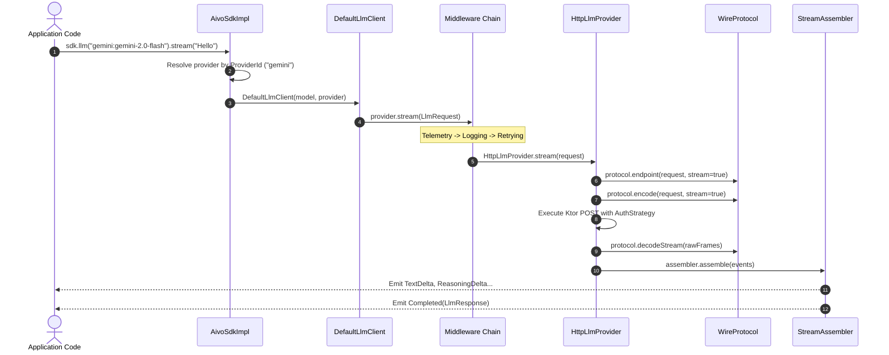
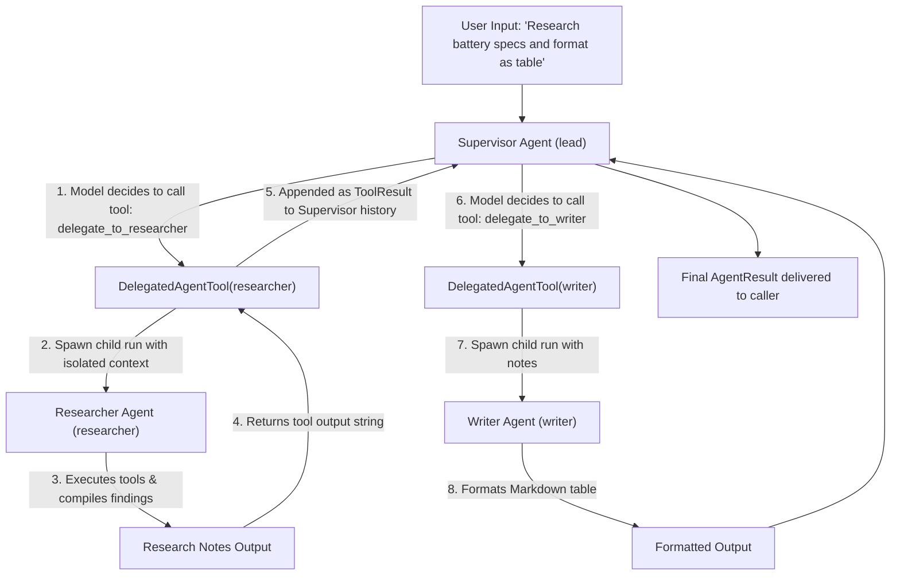
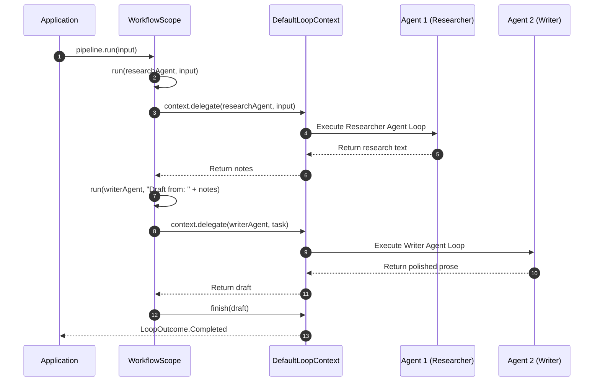
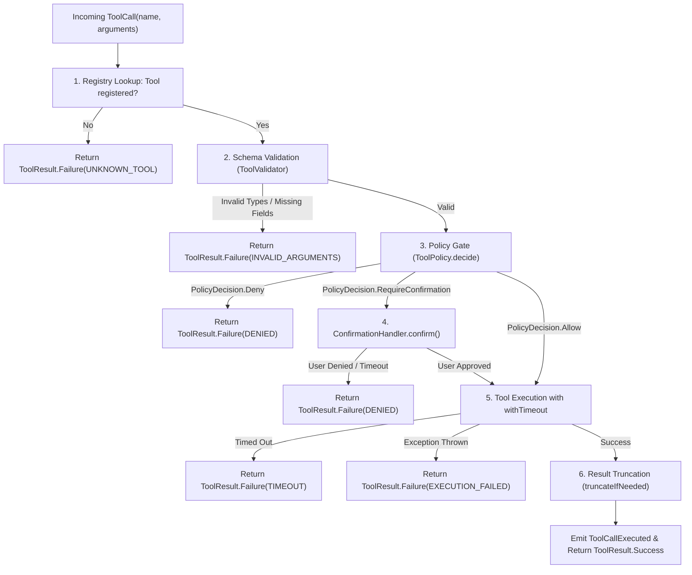
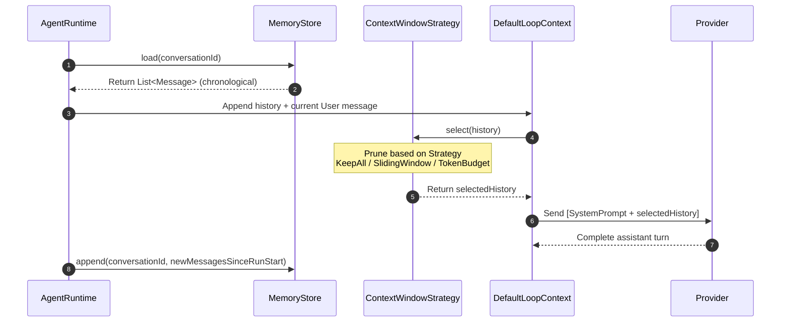
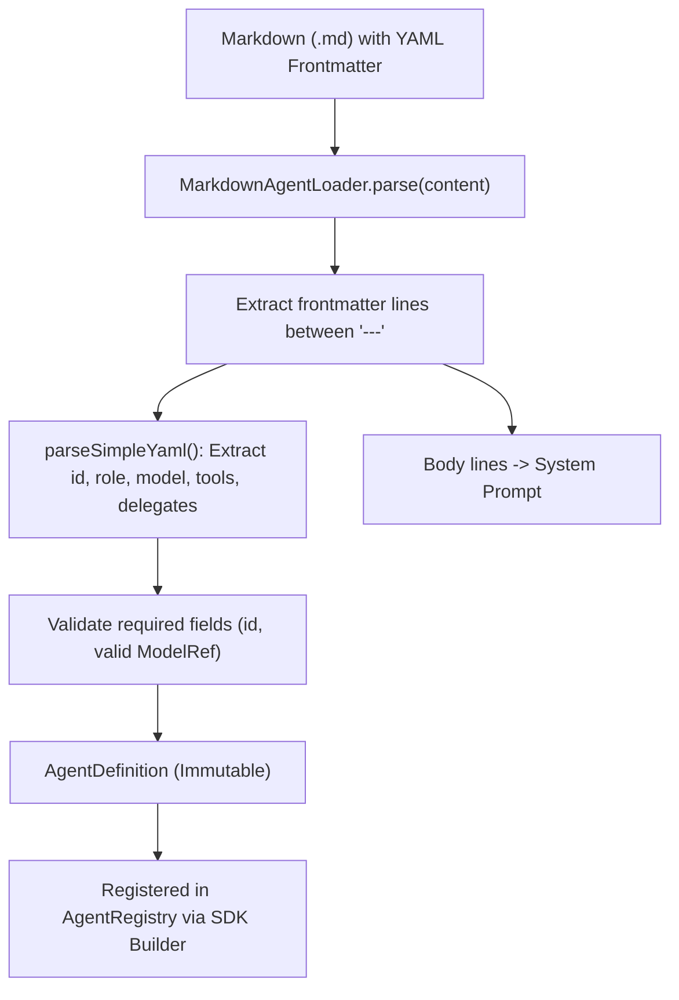

# Execution Flows & Subsystem Lifecycles

This document details the exact execution paths, data transformations, and sequence diagrams for all major flows in the Aivo SDK.

---

## ⚡ Flow 1: Level 1 — Raw LLM Client Call

Used when interacting directly with a language model without spawning agent reasoning loops or maintaining state.



### Trace Details
1. **Entry:** App calls `sdk.llm(model).generate(prompt)` or `sdk.llm(model).stream(prompt)`.
2. **Provider Resolution:** Resolves the decorated [`LlmProvider`](file:///d:/Projects/AivoSdk/sdk-core/src/commonMain/kotlin/com/aivo/sdk/core/port/Ports.kt#L31) from `providers` map using `model.provider`.
3. **Middleware Pipeline:**
   - [`TelemetryLlmProvider`](file:///d:/Projects/AivoSdk/sdk-middleware/src/commonMain/kotlin/com/aivo/sdk/middleware/TelemetryLlmProvider.kt): Emits `TelemetryEvent.LlmCallStarted`.
   - [`LoggingLlmProvider`](file:///d:/Projects/AivoSdk/sdk-middleware/src/commonMain/kotlin/com/aivo/sdk/middleware/LoggingLlmProvider.kt): Logs the outgoing request (with credentials and payloads sanitized via [`Redactor`](file:///d:/Projects/AivoSdk/sdk-core/src/commonMain/kotlin/com/aivo/sdk/core/port/Ports.kt#L410)).
   - [`RetryingLlmProvider`](file:///d:/Projects/AivoSdk/sdk-middleware/src/commonMain/kotlin/com/aivo/sdk/middleware/RetryingLlmProvider.kt): Prepares retry loop with exponential backoff and jitter.
4. **Transport & Framing:** [`HttpLlmProvider`](file:///d:/Projects/AivoSdk/sdk-transport/src/commonMain/kotlin/com/aivo/sdk/transport/HttpLlmProvider.kt) delegates payload encoding and framing (SSE/NDJSON) to the provider's [`WireProtocol`](file:///d:/Projects/AivoSdk/sdk-transport/src/commonMain/kotlin/com/aivo/sdk/transport/protocol/WireProtocol.kt).
5. **Stream Assembly:** [`StreamAssembler`](file:///d:/Projects/AivoSdk/sdk-core/src/commonMain/kotlin/com/aivo/sdk/core/stream/StreamAssembler.kt) accumulates deltas, guarantees that all tokens reach the caller in real-time, and generates a terminal `LlmStreamEvent.Completed` event.

---

## 🔄 Flow 2: Level 2 — ReAct Agent Loop & Tool Calling

The standard autonomous agent cycle: Think -> Act on tool calls -> Think -> Finish.

```mermaid
sequenceDiagram
    autonumber
    actor App as Application Code
    participant Runtime as AgentRuntime
    participant Ctx as DefaultLoopContext
    participant Loop as ToolCallingLoop
    participant Model as LLM Provider
    participant ToolExec as ToolExecutor
    participant Mem as MemoryStore

    App->>Runtime: sdk.chat(convId, "What's my balance?")
    Runtime->>Runtime: Acquire per-conversation mutex lock
    Runtime->>Mem: load(convId)
    Runtime->>Ctx: Init history + user message
    Runtime->>Loop: loop.run(loopContext)

    loop ReAct Execution Cycle
        Loop->>Ctx: think()
        Ctx->>Model: provider.stream(LlmRequest)
        Model-->>Ctx: Stream response with ToolCall("get_balance")
        Ctx-->>Loop: Return Turn.Call(calls)

        Loop->>Ctx: act(calls)
        Ctx->>ToolExec: execute(tool, call, context)
        ToolExec-->>Ctx: Return ToolResult.Success(balance)
        Ctx->>Ctx: Record Tool message in history
    end

    Loop->>Ctx: think() [Synthesis Turn]
    Ctx->>Model: provider.stream(LlmRequest with Tool results)
    Model-->>Ctx: "Your balance is $150."
    Ctx-->>Loop: Return Turn.Text("Your balance is $150.")
    Loop->>Ctx: finish(text)
    Ctx-->>Runtime: Return LoopOutcome.Completed

    Runtime->>Mem: append(convId, newMessages) [Atomic write]
    Runtime->>Runtime: Release conversation mutex lock
    Runtime-->>App: Return AgentResult
```

### Trace Details
1. **Concurrency Lock:** [`AgentRuntime`](file:///d:/Projects/AivoSdk/sdk-runtime/src/commonMain/kotlin/com/aivo/sdk/runtime/agent/AgentRuntime.kt) acquires `getConversationLock(conversationId)` to prevent race conditions within the same conversation.
2. **Context Assembly:** [`DefaultLoopContext.think()`](file:///d:/Projects/AivoSdk/sdk-runtime/src/commonMain/kotlin/com/aivo/sdk/runtime/agent/DefaultLoopContext.kt#L112) trims history via [`ContextWindowStrategy`](file:///d:/Projects/AivoSdk/sdk-runtime/src/commonMain/kotlin/com/aivo/sdk/runtime/memory/context/ContextWindowStrategy.kt), applies prompt templates, resolves authorized tools, and invokes the model.
3. **Tool Dispatch:** When the model outputs tool calls, [`ToolCallingLoop`](file:///d:/Projects/AivoSdk/sdk-runtime/src/commonMain/kotlin/com/aivo/sdk/runtime/agent/ToolCallingLoop.kt) executes them via [`DefaultLoopContext.act()`](file:///d:/Projects/AivoSdk/sdk-runtime/src/commonMain/kotlin/com/aivo/sdk/runtime/agent/DefaultLoopContext.kt#L232).
4. **Loop Protection:** If the model repeats the exact same tool calls or exceeds `maxConsecutiveToolCalls`, `ToolCallingLoop` forces a final turn with `ToolSelection.None` to compel textual synthesis.
5. **Persistence:** On `LoopOutcome.Completed`, all messages generated during the run are appended to [`MemoryStore`](file:///d:/Projects/AivoSdk/sdk-core/src/commonMain/kotlin/com/aivo/sdk/core/port/Ports.kt#L114) in a single atomic transaction.

---

## 👥 Flow 3: Level 3 — Multi-Agent Supervisor & Model-Driven Delegation

A supervisor agent delegates tasks to specialized sub-agents dynamically based on user intent.



### Trace Details
1. **Dynamic Tool Generation:** When an agent specifies `delegates("researcher", "writer")`, [`DefaultLoopContext`](file:///d:/Projects/AivoSdk/sdk-runtime/src/commonMain/kotlin/com/aivo/sdk/runtime/agent/DefaultLoopContext.kt#L363) automatically manufactures [`DelegatedAgentTool`](file:///d:/Projects/AivoSdk/sdk-runtime/src/commonMain/kotlin/com/aivo/sdk/runtime/delegation/AgentAsToolStrategy.kt) instances named `delegate_to_<agentId>`.
2. **Cycle & Depth Protection:** Before executing a child agent, `DelegatedAgentTool` verifies:
   - `!currentAgentPath.contains(childId)` (prevents recursion loops; throws [`DelegationCycleException`](file:///d:/Projects/AivoSdk/sdk-core/src/commonMain/kotlin/com/aivo/sdk/core/error/Exceptions.kt)).
   - `currentAgentPath.size <= maxDelegationDepth` (prevents stack overflow; throws [`MaxDelegationDepthExceededException`](file:///d:/Projects/AivoSdk/sdk-core/src/commonMain/kotlin/com/aivo/sdk/core/error/Exceptions.kt)).
3. **Child Context Isolation:** Child agents run in an isolated child conversation (`${conversationId}_${childId}`) so sub-agent history does not pollute the supervisor's context window.
4. **Blackboard State Sharing:** If child agents define `saveResultAs`, their results are stored in the shared [`RunState`](file:///d:/Projects/AivoSdk/sdk-core/src/commonMain/kotlin/com/aivo/sdk/core/model/RunState.kt) blackboard accessible to all agents in the run.

---

## 🔀 Flow 4: Level 4 — Deterministic Workflows & Custom Reasoning Loops

When orchestration logic must be strictly controlled in code rather than left to LLM discretion.

```kotlin
// Example: Workflow DSL
val pipeline = agent("pipeline") {
    loop = workflow(researchAgent, writerAgent) {
        val notes = run(researchAgent, input)
        val draft = run(writerAgent, "Write response based on:\n$notes")
        finish(draft)
    }
}
```



### Prebuilt Loops Available:
* [`SingleTurnLoop`](file:///d:/Projects/AivoSdk/sdk-runtime/src/commonMain/kotlin/com/aivo/sdk/runtime/agent/PrebuiltLoops.kt#L14): Disables tool calling (`ToolSelection.None`) for pure single-shot generation.
* [`SequenceLoop`](file:///d:/Projects/AivoSdk/sdk-runtime/src/commonMain/kotlin/com/aivo/sdk/runtime/agent/PrebuiltLoops.kt#L32): Executes a chain of agents sequentially, feeding each output as the next input.
* [`RouterLoop`](file:///d:/Projects/AivoSdk/sdk-runtime/src/commonMain/kotlin/com/aivo/sdk/runtime/agent/PrebuiltLoops.kt#L52): Runs a custom selector lambda on user input to choose a single destination agent.
* [`ParallelLoop`](file:///d:/Projects/AivoSdk/sdk-runtime/src/commonMain/kotlin/com/aivo/sdk/runtime/agent/PrebuiltLoops.kt#L67): Executes multiple agents concurrently via `context.parallel()` and merges results using a combiner function.

---

## 🛡️ Flow 5: Tool Execution Safety Pipeline

Every tool call generated by an LLM passes through a 6-stage security and validation pipeline in [`ToolExecutor`](file:///d:/Projects/AivoSdk/sdk-runtime/src/commonMain/kotlin/com/aivo/sdk/runtime/tool/ToolExecutor.kt).



### Pipeline Guarantees
1. **Never Throws:** Tool implementations cannot crash the agent loop; any unhandled exception (except `CancellationException`) is caught and packaged as [`ToolResult.Failure`](file:///d:/Projects/AivoSdk/sdk-core/src/commonMain/kotlin/com/aivo/sdk/core/model/LlmTypes.kt).
2. **Safe Confirmation:** If a tool has `requiresConfirmation = true` or `ToolRisk.HIGH`, execution suspends until [`ConfirmationHandler`](file:///d:/Projects/AivoSdk/sdk-core/src/commonMain/kotlin/com/aivo/sdk/core/port/Ports.kt#L356) returns `true`.
3. **Token Guard:** Strings in `ToolResult.Success` exceeding `maxToolResultChars` are safely truncated to protect token budgets.

---

## 🧠 Flow 6: Memory & Context Window Lifecycle

How conversations are loaded, pruned to fit token limits, and persisted.



### Strategies in [`ContextWindowStrategy.kt`](file:///d:/Projects/AivoSdk/sdk-runtime/src/commonMain/kotlin/com/aivo/sdk/runtime/memory/context/ContextWindowStrategy.kt):
1. **`KeepAllStrategy`:** Returns all messages unmodified. Best for short tasks.
2. **`SlidingWindowStrategy(maxMessages)`:** Retains only the most recent $N$ messages. Always preserves the first system prompt if present.
3. **`TokenBudgetStrategy(maxTokens, estimator)`:** Counts tokens backwards from newest to oldest using [`TokenEstimator`](file:///d:/Projects/AivoSdk/sdk-core/src/commonMain/kotlin/com/aivo/sdk/core/port/Ports.kt#L335) until the budget is reached. Never drops an assistant tool call without its corresponding tool result message.

---

## 🌐 Flow 7: Wire Protocol & Transport Dispatch

How domain models are translated to provider-specific HTTP bodies and reconstructed from network streams.

```mermaid
graph LR
    Req["LlmRequest (Core Model)"] -->|"protocol.encode()"| WireReq["Provider JSON Payload"]
    WireReq -->|"Ktor HTTP POST"| WireStream["Raw Byte Stream"]
    WireStream -->|"SseDecoder / NdjsonDecoder"| Frames["RawFrame.Data / RawFrame.Done"]
    Frames -->|"protocol.decodeStream()"| DomainEvents["LlmStreamEvent Deltas"]
    DomainEvents -->|"StreamAssembler.assemble()"| CompleteStream["Flow<LlmStreamEvent> + Completed"]
```



### Key Components:
* **Framing Decoupling:** [`SseDecoder`](file:///d:/Projects/AivoSdk/sdk-transport/src/commonMain/kotlin/com/aivo/sdk/transport/decoder/SseDecoder.kt) and [`NdjsonDecoder`](file:///d:/Projects/AivoSdk/sdk-transport/src/commonMain/kotlin/com/aivo/sdk/transport/decoder/NdjsonDecoder.kt) handle HTTP line chunking and SSE syntax (`data: `, `event: `, `[DONE]`).
* **Frame Translation:** [`WireProtocol.decodeStream()`](file:///d:/Projects/AivoSdk/sdk-transport/src/commonMain/kotlin/com/aivo/sdk/transport/protocol/WireProtocol.kt) parses JSON payloads into domain events (`TextDelta`, `ToolCallStarted`, `ToolCallArgumentsDelta`).
* **Assembler Guarantees:** [`StreamAssembler`](file:///d:/Projects/AivoSdk/sdk-core/src/commonMain/kotlin/com/aivo/sdk/core/stream/StreamAssembler.kt) guarantees that downstream consumers always receive a well-formed `LlmStreamEvent.Completed` event containing the aggregated `LlmResponse` and usage metrics.

---

## 📄 Flow 8: Declarative Agent Loading Lifecycle

How agents declared in external files are loaded into runtime structures.



### Error Handling:
If frontmatter delimiters (`---`) are missing, or required fields like `id` are absent, [`MarkdownAgentLoader`](file:///d:/Projects/AivoSdk/sdk-agent-config/src/commonMain/kotlin/com/aivo/sdk/agent/config/MarkdownAgentLoader.kt) throws [`ConfigurationException`](file:///d:/Projects/AivoSdk/sdk-core/src/commonMain/kotlin/com/aivo/sdk/core/error/Exceptions.kt) with an explicit list of validation issues.
