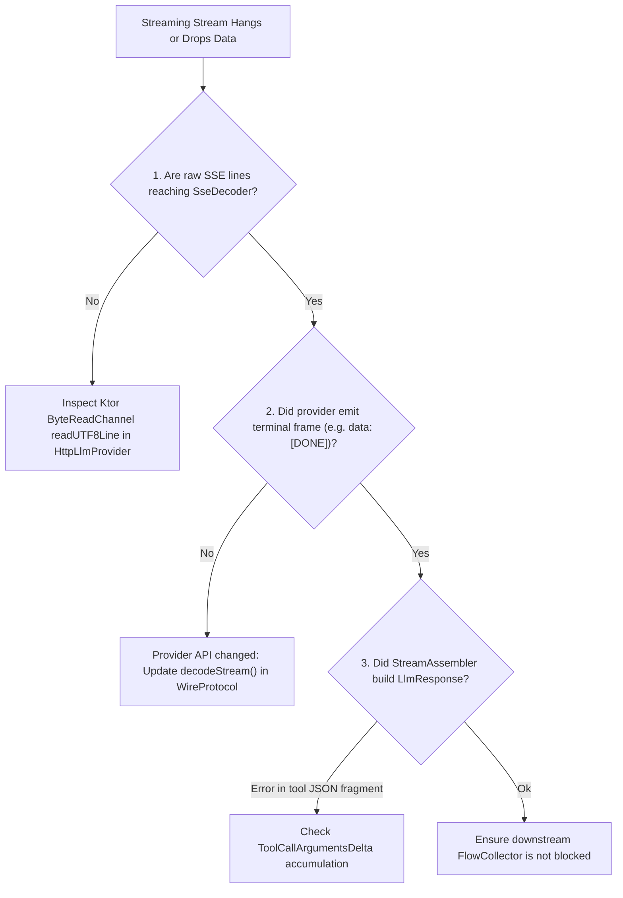

# Debugging & Troubleshooting Playbook

This playbook provides actionable, step-by-step diagnostic workflows for identifying and resolving bugs across the Aivo SDK.

---

## 🔍 Bug Category 1: Streaming Glitches & Missing Events

### Symptoms
* The UI streams tokens, but the flow never terminates (hangs indefinitely).
* Tokens appear truncated or cut off mid-sentence.
* No `AgentEvent.RunCompleted` or `LlmStreamEvent.Completed` is received.

### Root Cause Analysis & Fixes



1. **Missing `[DONE]` Frame:**
   - **Location:** [`SseDecoder.kt`](file:///d:/Projects/AivoSdk/sdk-transport/src/commonMain/kotlin/com/aivo/sdk/transport/decoder/SseDecoder.kt)
   - Some OpenAI-compatible endpoints or proxies terminate connections on HTTP EOF rather than sending `data: [DONE]`.
   - **Fix:** In [`HttpLlmProvider.kt`](file:///d:/Projects/AivoSdk/sdk-transport/src/commonMain/kotlin/com/aivo/sdk/transport/HttpLlmProvider.kt), ensure the line reading loop cleanly finishes when `channel.readUTF8Line()` returns `null`, and [`StreamAssembler`](file:///d:/Projects/AivoSdk/sdk-core/src/commonMain/kotlin/com/aivo/sdk/core/stream/StreamAssembler.kt) synthesizes the `Completed` event from buffered tokens.

2. **Malformed Tool Call JSON Fragments:**
   - **Location:** [`StreamAssembler.kt`](file:///d:/Projects/AivoSdk/sdk-core/src/commonMain/kotlin/com/aivo/sdk/core/stream/StreamAssembler.kt#L94-L97)
   - When an LLM streams function call arguments, it delivers partial strings like `{"city":` followed by `"Paris"}`.
   - If the assembler attempts to deserialize incomplete fragments per event rather than concatenating them in `toolCallBuilders[index].argBuffer`, serialization errors occur.
   - **Fix:** Ensure argument fragments are strictly concatenated as raw strings and parsed into [`JsonObject`](file:///d:/Projects/AivoSdk/sdk-core/src/commonMain/kotlin/com/aivo/sdk/core/model/LlmTypes.kt) only upon stream completion.

---

## 🛠️ Bug Category 2: Tool Validation & Execution Failures

### Symptoms
* Tool returns `ToolFailureKind.INVALID_ARGUMENTS` even when the model supplied arguments.
* Tool execution causes a coroutine timeout.
* The agent repeatedly executes the same tool without finishing.

### Diagnostic Checklist

| Check | File | What to Inspect |
|---|---|---|
| **Parameter Types** | [`ToolValidator.kt`](file:///d:/Projects/AivoSdk/sdk-runtime/src/commonMain/kotlin/com/aivo/sdk/runtime/tool/ToolValidator.kt) | Ensure integer parameters sent as JSON numbers are not expected as strings. |
| **Required List** | [`JsonSchema.kt`](file:///d:/Projects/AivoSdk/sdk-runtime/src/commonMain/kotlin/com/aivo/sdk/runtime/tool/schema/JsonSchema.kt) | Check whether optional parameters were inadvertently included in the schema's `required` list. |
| **Timeout Settings** | [`ToolExecutor.kt`](file:///d:/Projects/AivoSdk/sdk-runtime/src/commonMain/kotlin/com/aivo/sdk/runtime/tool/ToolExecutor.kt#L90) | Default timeout is 30s. For long-running tools, increase `toolTimeoutMs` in `runtime { }`. |
| **Looping Behavior** | [`ToolCallingLoop.kt`](file:///d:/Projects/AivoSdk/sdk-runtime/src/commonMain/kotlin/com/aivo/sdk/runtime/agent/ToolCallingLoop.kt#L38) | Inspect `seenSignatures` and `maxConsecutiveToolCalls`. If a model loops, the SDK forces a synthesis turn with tools disabled. |

### Handling Tool Exceptions Safely
Never allow tool logic to throw raw exceptions across the SDK boundary. Use [`ToolResult.Failure`](file:///d:/Projects/AivoSdk/sdk-core/src/commonMain/kotlin/com/aivo/sdk/core/model/LlmTypes.kt):

```kotlin
// ✅ CORRECT: Catch exceptions and return structured failure
execute { call, context ->
    try {
        val result = api.query(call.arguments["id"]?.jsonPrimitive?.content ?: "")
        ToolResult.Success(result)
    } catch (e: CancellationException) {
        throw e // NEVER swallow cancellation
    } catch (e: Exception) {
        ToolResult.Failure(ToolFailureKind.EXECUTION_FAILED, "Query failed: ${e.message}")
    }
}
```

---

## 🌐 Bug Category 3: Provider API Changes & Status Code Mapping

When an LLM provider updates its REST API endpoints, wire schemas, or error responses:

### 1. Updating Endpoints & Request Encoding
* Check [`WireProtocol.endpoint()`](file:///d:/Projects/AivoSdk/sdk-transport/src/commonMain/kotlin/com/aivo/sdk/transport/protocol/WireProtocol.kt) and [`WireProtocol.encode()`](file:///d:/Projects/AivoSdk/sdk-transport/src/commonMain/kotlin/com/aivo/sdk/transport/protocol/WireProtocol.kt).
* In Gemini ([`GeminiWireProtocol.kt`](file:///d:/Projects/AivoSdk/sdk-provider-gemini/src/commonMain/kotlin/com/aivo/sdk/provider/gemini/GeminiWireProtocol.kt)):
  * Streaming uses `:streamGenerateContent?alt=sse`.
  * Ensure system instructions use the `system_instruction` object rather than being merged into user turns.
* In Ollama ([`OllamaWireProtocol.kt`](file:///d:/Projects/AivoSdk/sdk-provider-ollama/src/commonMain/kotlin/com/aivo/sdk/provider/ollama/OllamaWireProtocol.kt)):
  * Streaming uses `stream = true` in `/api/chat`.
  * Ensure tool calls are formatted as a JSON array under `message.tool_calls`.

### 2. Error Mapping Rules in `mapError()`
All HTTP status codes must map to typed [`SdkException`](file:///d:/Projects/AivoSdk/sdk-core/src/commonMain/kotlin/com/aivo/sdk/core/error/Exceptions.kt) subclasses:

```kotlin
// Example from WireProtocol.mapError:
when (statusCode) {
    400 -> InvalidRequestException(providerId, "Bad request: $body")
    401, 403 -> AuthenticationException(providerId, "Authentication failed: $body")
    404 -> ModelNotFoundException(providerId, "Model not found: $body")
    429 -> RateLimitException(providerId, "Rate limit exceeded", retryAfterMs = parseRetryAfter(headers))
    500, 502, 503, 504 -> ServerErrorException(providerId, statusCode, "Server error: $body", retryable = true)
    else -> ProviderException(providerId, "Provider error $statusCode: $body")
}
```

> [!IMPORTANT]
> Always set `retryable = true` on transient HTTP errors (429, 502, 503, 504). This enables [`RetryingLlmProvider`](file:///d:/Projects/AivoSdk/sdk-middleware/src/commonMain/kotlin/com/aivo/sdk/middleware/RetryingLlmProvider.kt) to automatically resolve temporary outages with exponential backoff.

---

## 🔒 Bug Category 4: Concurrency & Mutex Deadlocks

### Concurrency Policies
In [`AgentRuntime.kt`](file:///d:/Projects/AivoSdk/sdk-runtime/src/commonMain/kotlin/com/aivo/sdk/runtime/agent/AgentRuntime.kt#L128), every run acquires a mutex keyed by [`ConversationId`](file:///d:/Projects/AivoSdk/sdk-core/src/commonMain/kotlin/com/aivo/sdk/core/model/Identifiers.kt):
* `ConcurrencyPolicy.QUEUE` (Default): Suspending calls wait in line.
* `ConcurrencyPolicy.REJECT`: Throws [`ConcurrentRunException`](file:///d:/Projects/AivoSdk/sdk-core/src/commonMain/kotlin/com/aivo/sdk/core/error/Exceptions.kt) immediately if another run is active on the same conversation.

### Preventing Delegation Deadlocks
* If a supervisor agent on `conv1` delegates to a child agent, and the child agent attempts to acquire the lock for `conv1`, a coroutine deadlock occurs.
* **Architecture Fix:** Child runs in [`AgentRuntime.kt`](file:///d:/Projects/AivoSdk/sdk-runtime/src/commonMain/kotlin/com/aivo/sdk/runtime/agent/AgentRuntime.kt#L234) automatically use an isolated conversation ID:  
  `val childConvo = ConversationId("${conversationId.value}_${childAgent.id}")`
* This guarantees the child run never contends for the parent agent's conversation mutex.

---

## ⏱️ Bug Category 5: Cancellation & Coroutine Cleanup

### The Golden Rule
> **NEVER catch `Throwable` or `Exception` without rethrowing `CancellationException`.**

```kotlin
// ❌ INCORRECT: Suppresses cooperative cancellation
try {
    doWork()
} catch (e: Exception) {
    logger.error { "Failed" }
}

// ✅ CORRECT: Preserves cancellation semantics
try {
    doWork()
} catch (e: CancellationException) {
    throw e
} catch (e: Exception) {
    logger.error { "Failed: ${e.message}" }
}
```

### Timeout Differentiation
In [`AgentRuntime.kt`](file:///d:/Projects/AivoSdk/sdk-runtime/src/commonMain/kotlin/com/aivo/sdk/runtime/agent/AgentRuntime.kt#L157-L163) and [`ToolExecutor.kt`](file:///d:/Projects/AivoSdk/sdk-runtime/src/commonMain/kotlin/com/aivo/sdk/runtime/tool/ToolExecutor.kt#L93-L101):
* Check `if (e is TimeoutCancellationException)`: Convert to domain [`RunTimeoutException`](file:///d:/Projects/AivoSdk/sdk-core/src/commonMain/kotlin/com/aivo/sdk/core/error/Exceptions.kt) or [`ToolFailureKind.TIMEOUT`](file:///d:/Projects/AivoSdk/sdk-core/src/commonMain/kotlin/com/aivo/sdk/core/model/LlmTypes.kt).
* If `e` is standard `CancellationException`: Always rethrow to allow the parent coroutine scope to shut down cleanly.

---

## 🧪 Bug Category 6: Writing Deterministic Offline Tests

Never use real API keys or network connections in automated tests. Use [`FakeLlmProvider`](file:///d:/Projects/AivoSdk/sdk-testing/src/commonMain/kotlin/com/aivo/sdk/testing/FakeLlmProvider.kt).

### Example 1: Testing an Agent with Scripted Tool Calls

```kotlin
@Test
fun test_agent_react_cycle() = runTest {
    // 1. Script responses: First turn emits tool call, second turn emits text
    val fakeProvider = FakeLlmProvider(
        responses = listOf(
            FakeResponse.ToolCalls(
                listOf(ToolCall(id = "c1", name = "get_weather", arguments = buildJsonObject { put("city", "Cairo") }))
            ),
            FakeResponse.Text("It is sunny in Cairo.")
        )
    )

    // 2. Build test SDK instance
    val sdk = AivoSdk {
        providers { register(fakeProvider) }
        defaultModel("fake:test-model")
        tools { +getWeatherTool }
        agents {
            define("assistant") {
                tools("get_weather")
            }
        }
        entryAgent("assistant")
    }

    // 3. Execute and verify
    val result = sdk.chat(ConversationId("test_conv"), "What's the weather in Cairo?")
    assertEquals("It is sunny in Cairo.", result.text)
    assertEquals(1, result.toolCalls.size)
    assertEquals("get_weather", result.toolCalls.first().name)
}
```

### Example 2: Testing Transient Retries & Backoff

```kotlin
@Test
fun test_retries_transient_failure() = runTest {
    val fakeProvider = FakeLlmProvider(
        responses = listOf(
            FakeResponse.Error(ServerErrorException(ProviderId("fake"), 503, "Unavailable", retryable = true)),
            FakeResponse.Text("Success on retry")
        )
    )

    val retryingProvider = RetryingLlmProvider(
        delegate = fakeProvider,
        policy = RetryPolicy(maxRetries = 2, initialDelayMs = 10L),
        delayFn = { /* no-op delay in virtual time */ }
    )

    val response = retryingProvider.generate(testLlmRequest)
    assertEquals("Success on retry", response.message.text)
}
```
