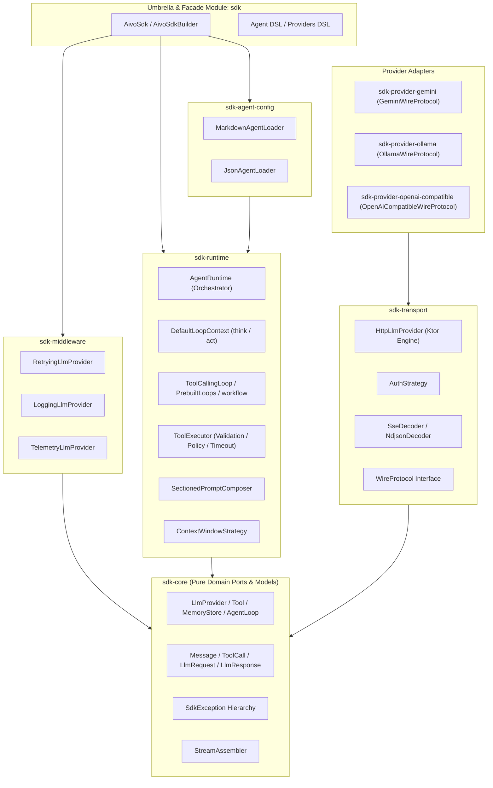

# Aivo SDK — Developer & Contributor Guide

Welcome to the internal development guide for the **Aivo SDK** (`io.github.abdallah-elsobky:aivo-sdk`). This documentation is designed for contributors and maintainers to provide an end-to-end understanding of how every module, file, and runtime flow operates, how to modify them safely, and how to rapidly isolate and fix bugs.

---

## 🗺️ High-Level System Architecture

The SDK strictly follows the **Hexagonal / Ports-and-Adapters Architecture** and enforces the **Inward Dependency Rule**: inner modules know nothing about outer modules.

---

## 📑 Documentation Index

The developer guide is divided into five deep-dive documents:

| Document | Description |
|---|---|
| [01. Architecture & File Inventory](01-architecture-and-file-inventory.md) | Exhaustive, file-by-file directory across all 10 SDK modules. Explains what every single file does, how to edit it, and its invariants. |
| [02. Execution Flows & Lifecycles](02-execution-flows.md) | Step-by-step trace and sequence diagrams for all 8 core flows: Level 1 LLM, Level 2 ReAct Loop, Level 3 Supervisor, Level 4 Workflows, Tool Safety Pipeline, Memory, Transport, and Declarative Loading. |
| [03. Debugging & Troubleshooting Playbook](03-debugging-and-troubleshooting-playbook.md) | Practical root-cause analysis and battle-tested solutions for streaming glitches, tool schema validation errors, concurrency deadlocks, cancellation leaks, and provider API changes. |
| [04. Extending the SDK](04-extending-the-sdk.md) | Guide for adding new LLM providers, custom wire protocols, custom memory stores, and custom reasoning loops. |
| [Architecture Decision Records (ADR)](adr/) | Historical record of key architectural choices and design invariants. |

---

## ⚡ Fast File Lookup: "Where Do I Fix...?"

Use this reference table to immediately find the file responsible for your task or bug:

| Symptom / Task | Primary File | Supporting File |
|---|---|---|
| **Streaming token cutoffs, missing completion event** | [`StreamAssembler.kt`](file:///d:/Projects/AivoSdk/sdk-core/src/commonMain/kotlin/com/aivo/sdk/core/stream/StreamAssembler.kt) | [`HttpLlmProvider.kt`](file:///d:/Projects/AivoSdk/sdk-transport/src/commonMain/kotlin/com/aivo/sdk/transport/HttpLlmProvider.kt) |
| **SSE / NDJSON parsing errors (hanging stream)** | [`SseDecoder.kt`](file:///d:/Projects/AivoSdk/sdk-transport/src/commonMain/kotlin/com/aivo/sdk/transport/decoder/SseDecoder.kt) | [`NdjsonDecoder.kt`](file:///d:/Projects/AivoSdk/sdk-transport/src/commonMain/kotlin/com/aivo/sdk/transport/decoder/NdjsonDecoder.kt) |
| **Agent loops forever on the same tool call** | [`ToolCallingLoop.kt`](file:///d:/Projects/AivoSdk/sdk-runtime/src/commonMain/kotlin/com/aivo/sdk/runtime/agent/ToolCallingLoop.kt) | [`DefaultLoopContext.kt`](file:///d:/Projects/AivoSdk/sdk-runtime/src/commonMain/kotlin/com/aivo/sdk/runtime/agent/DefaultLoopContext.kt) |
| **Tool parameter validation failing unexpectedly** | [`ToolValidator.kt`](file:///d:/Projects/AivoSdk/sdk-runtime/src/commonMain/kotlin/com/aivo/sdk/runtime/tool/ToolValidator.kt) | [`JsonSchema.kt`](file:///d:/Projects/AivoSdk/sdk-runtime/src/commonMain/kotlin/com/aivo/sdk/runtime/tool/schema/JsonSchema.kt) |
| **Tool execution timeout, confirmation dialog, or truncation** | [`ToolExecutor.kt`](file:///d:/Projects/AivoSdk/sdk-runtime/src/commonMain/kotlin/com/aivo/sdk/runtime/tool/ToolExecutor.kt) | [`Ports.kt`](file:///d:/Projects/AivoSdk/sdk-core/src/commonMain/kotlin/com/aivo/sdk/core/port/Ports.kt) |
| **Supervisor delegation cycle or depth exceeded** | [`AgentAsToolStrategy.kt`](file:///d:/Projects/AivoSdk/sdk-runtime/src/commonMain/kotlin/com/aivo/sdk/runtime/delegation/AgentAsToolStrategy.kt) | [`DefaultLoopContext.kt`](file:///d:/Projects/AivoSdk/sdk-runtime/src/commonMain/kotlin/com/aivo/sdk/runtime/agent/DefaultLoopContext.kt) |
| **Context window token trimming or message drop bug** | [`ContextWindowStrategy.kt`](file:///d:/Projects/AivoSdk/sdk-runtime/src/commonMain/kotlin/com/aivo/sdk/runtime/memory/context/ContextWindowStrategy.kt) | [`InMemoryMemoryStore.kt`](file:///d:/Projects/AivoSdk/sdk-runtime/src/commonMain/kotlin/com/aivo/sdk/runtime/memory/InMemoryMemoryStore.kt) |
| **Prompt `{{variable}}` substitution failure** | [`PromptRenderer.kt`](file:///d:/Projects/AivoSdk/sdk-runtime/src/commonMain/kotlin/com/aivo/sdk/runtime/prompt/PromptRenderer.kt) | [`SectionedPromptComposer.kt`](file:///d:/Projects/AivoSdk/sdk-runtime/src/commonMain/kotlin/com/aivo/sdk/runtime/prompt/SectionedPromptComposer.kt) |
| **Gemini API change / payload serialization error** | [`GeminiWireProtocol.kt`](file:///d:/Projects/AivoSdk/sdk-provider-gemini/src/commonMain/kotlin/com/aivo/sdk/provider/gemini/GeminiWireProtocol.kt) | [`GeminiProvider.kt`](file:///d:/Projects/AivoSdk/sdk-provider-gemini/src/commonMain/kotlin/com/aivo/sdk/provider/gemini/GeminiProvider.kt) |
| **Ollama wire protocol / streaming tool call mismatch** | [`OllamaWireProtocol.kt`](file:///d:/Projects/AivoSdk/sdk-provider-ollama/src/commonMain/kotlin/com/aivo/sdk/provider/ollama/OllamaWireProtocol.kt) | [`OllamaProvider.kt`](file:///d:/Projects/AivoSdk/sdk-provider-ollama/src/commonMain/kotlin/com/aivo/sdk/provider/ollama/OllamaProvider.kt) |
| **OpenAI / OpenRouter API mapping or header issue** | [`OpenAiCompatibleWireProtocol.kt`](file:///d:/Projects/AivoSdk/sdk-provider-openai-compatible/src/commonMain/kotlin/com/aivo/sdk/provider/openai/OpenAiCompatibleWireProtocol.kt) | [`OpenAiCompatibleProvider.kt`](file:///d:/Projects/AivoSdk/sdk-provider-openai-compatible/src/commonMain/kotlin/com/aivo/sdk/provider/openai/OpenAiCompatibleProvider.kt) |
| **Markdown frontmatter agent definition parsing bug** | [`MarkdownAgentLoader.kt`](file:///d:/Projects/AivoSdk/sdk-agent-config/src/commonMain/kotlin/com/aivo/sdk/agent/config/MarkdownAgentLoader.kt) | [`JsonAgentLoader.kt`](file:///d:/Projects/AivoSdk/sdk-agent-config/src/commonMain/kotlin/com/aivo/sdk/agent/config/JsonAgentLoader.kt) |
| **Retry backoff or rate-limit retry-after calculation** | [`RetryingLlmProvider.kt`](file:///d:/Projects/AivoSdk/sdk-middleware/src/commonMain/kotlin/com/aivo/sdk/middleware/RetryingLlmProvider.kt) | [`Exceptions.kt`](file:///d:/Projects/AivoSdk/sdk-core/src/commonMain/kotlin/com/aivo/sdk/core/error/Exceptions.kt) |
| **SDK Builder validation failure (duplicate agents/tools/cycles)** | [`AivoSdkBuilder.kt`](file:///d:/Projects/AivoSdk/sdk/src/commonMain/kotlin/com/aivo/sdk/AivoSdkBuilder.kt) | [`AivoSdkImpl.kt`](file:///d:/Projects/AivoSdk/sdk/src/commonMain/kotlin/com/aivo/sdk/AivoSdkImpl.kt) |
| **Writing offline unit tests for agents or tools** | [`FakeLlmProvider.kt`](file:///d:/Projects/AivoSdk/sdk-testing/src/commonMain/kotlin/com/aivo/sdk/testing/FakeLlmProvider.kt) | [`InMemoryTelemetry.kt`](file:///d:/Projects/AivoSdk/sdk-testing/src/commonMain/kotlin/com/aivo/sdk/testing/InMemoryTelemetry.kt) |

---

## 🛡️ Core Architectural Invariants (Must Never Violate)

When editing or extending the codebase, strictly adhere to these rules:

1. **Inward Dependency Rule:**
   - `sdk-core` has **zero** dependencies on Ktor, HTTP, JSON serialization engines, or concrete providers.
   - Provider modules (`sdk-provider-*`) depend only on `sdk-transport` and `sdk-core`. They **never** depend on `sdk-runtime` or each other.
   - `sdk-runtime` depends only on `sdk-core`. It never knows whether a provider communicates over HTTP, local IPC, or is a mock.
2. **Never Swallow `CancellationException`:**
   - Kotlin Coroutines rely on cooperative cancellation. Never catch `Throwable` or `Exception` without rethrowing `CancellationException`.
   - If wrapping timeouts, only convert `TimeoutCancellationException` to [`RunTimeoutException`](file:///d:/Projects/AivoSdk/sdk-core/src/commonMain/kotlin/com/aivo/sdk/core/error/Exceptions.kt) or [`ToolFailureKind.TIMEOUT`](file:///d:/Projects/AivoSdk/sdk-core/src/commonMain/kotlin/com/aivo/sdk/core/model/LlmTypes.kt); never suppress external coroutine cancellation.
3. **No Unchecked Exceptions Across Module Boundaries:**
   - Providers must catch transport and wire errors and translate them into typed [`SdkException`](file:///d:/Projects/AivoSdk/sdk-core/src/commonMain/kotlin/com/aivo/sdk/core/error/Exceptions.kt) subclasses.
   - Tools must catch their internal failures and return [`ToolResult.Failure`](file:///d:/Projects/AivoSdk/sdk-core/src/commonMain/kotlin/com/aivo/sdk/core/model/LlmTypes.kt).
4. **Security by Default:**
   - Secrets (`ApiKey`, bearer tokens) must be stored in [`SecretString`](file:///d:/Projects/AivoSdk/sdk-core/src/commonMain/kotlin/com/aivo/sdk/core/util/SecretString.kt) and masked by [`Redactor`](file:///d:/Projects/AivoSdk/sdk-core/src/commonMain/kotlin/com/aivo/sdk/core/port/Ports.kt).
   - Never log raw payloads or headers unless explicitly enabled in debug configurations.
5. **Pre-First-Event Retry Rule:**
   - [`RetryingLlmProvider`](file:///d:/Projects/AivoSdk/sdk-middleware/src/commonMain/kotlin/com/aivo/sdk/middleware/RetryingLlmProvider.kt) can only retry streaming requests **before** the first event has been emitted to the downstream flow collector to prevent duplicate tokens on the user screen.
